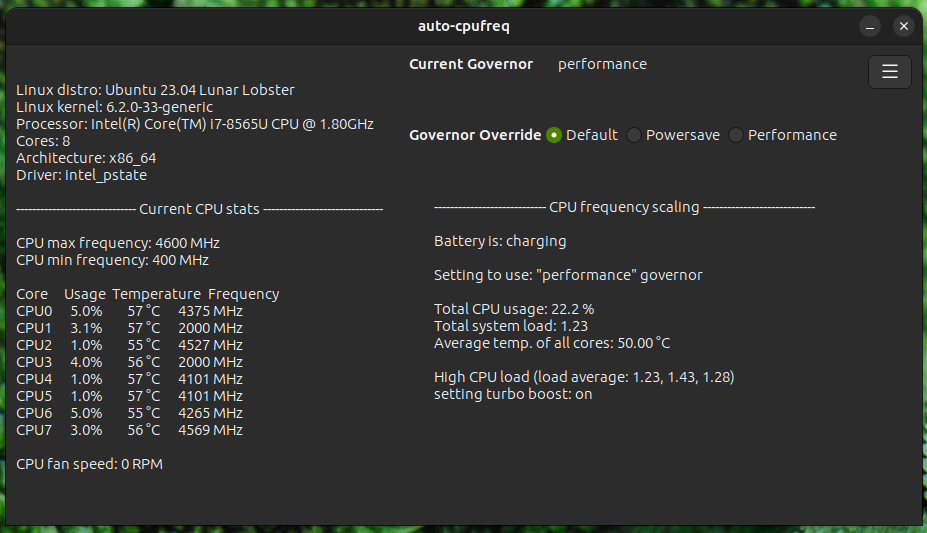

+++
title = 'Why I love auto-cpufreq'
date = 2023-10-19T14:10:40-05:00
tags = ["auto-cpufreq", "Linux", "Python"]
draft = false
+++

## Background

Back when I first started daily-driving Linux, I was on an Arch based distro. After noticing the sub-par battery life, I started to look around and found [this](https://wiki.archlinux.org/title/CPU_frequency_scaling) Arch wiki page about different CPU scaling softwares. 

All of the other ones sounded too complicated but auto-cpufreq stuck out as being simplistic and exactly what I was looking for. Other tools such as TLP were just offering more than what I needed. Meanwhile, auto-cpufreq is just a simple system service/CLI tool written in Python

A demo for auto-cpufreq and all of its features (as of writing this post) can be found [here on YouTube](https://www.youtube.com/watch?v=SPGpkZ0AZVU)

## Contributing

After using auto-cpufreq for a little bit I loved how it took care of everything for me and had drastically improved my battery life, but there were times when I still wanted to switch my laptop over to performance mode manually while doing something such as compiling a large package from source. 

I started browsing the GitHub repo and noticed this had been brought up before in a previous issue and decided to work on this feature and eventually submitted a [PR](https://github.com/AdnanHodzic/auto-cpufreq/pull/476).

After working with the project owner, [Adnan Hodzic](https://github.com/AdnanHodzic), the feature was accepted. However, in the midst of discussing this new change, another user brought up having a governer override available in a tray menu. Adnan agreed that I could work on implementing this. We ended up ditching this and I started working on a GUI instead.

## auto-cpufreq-gtk

We very recently introduced a GTK based GUI in v2.0.0 of auto-cpufreq. I am very grateful to Adnan for trusting me to work on creating the first GUI for auto-cpufreq. I personally find myself using it quite a bit and I hope others will as well. 

I am by no means a GUI designer, so I wanted to keep it simple. auto-cpufreq doesn't have a lot for the user to do so I only added what I thought was necessary. I think it turned out pretty well.

## Conclusion

I believe this tool is a necessity for any laptop running Linux. A very big thanks to Adnan for not only allowing me to be a part of this project, but for creating it in the first place and continuing to maintain it in his free time, despite being a very busy man

You can find the Github repo for auto-cpufreq [here](https://github.com/AdnanHodzic/auto-cpufreq)

If you want to get involved with the community or need help with the program, consider joining our [Discord server](https://discord.gg/Sjauxtj6kH)